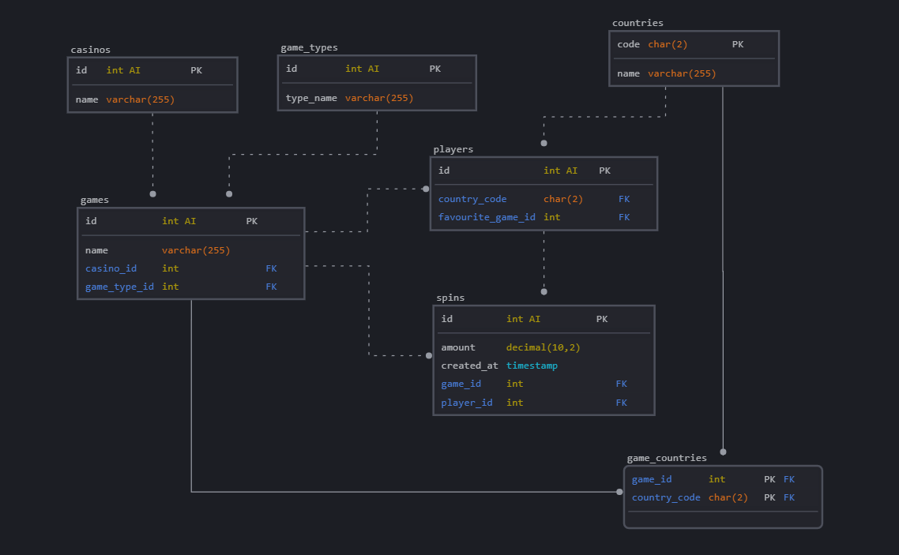

# Skivori-Fullstack

This assessement was made using VS Code, as well as Chat GPT and Copilot. Copilot was mainly used as a form to autocomplete some functions and comment code while writing code.
Chat GPT was used initially to get a TODO list of the assessement, as well as helping me debug and writing a better front end visual. Chat GPT was used as a helping tool on the writing of this small report.
Both the back end and front end were deployed to Azure, however due to restrictions on my free plan I could not change the cookies settings to enable sharing between the two domains.

The link for the deployed front end [Games](https://thankful-smoke-0ce40a11e.4.azurestaticapps.net).

# Backend Architecture Report

## Overview

The backend is built using **Node.js** with the **Express.js** framework to handle HTTP requests. It serves game-related data and implements a slot machine game with session-based user balance management. The system includes security features, caching, validation, and error handling.

## Key Components

### 1. **Game Data Handling** (games.controller.js)

- Reads game data from `game-data.json`.
- Processes the data to ensure each game has a thumbnail.
- Implements a search feature that filters games by title or provider name.
- Uses **try-catch** blocks to handle errors and return appropriate responses.

### 2. **Slot Machine Functionality** (slot.controller.js)

- Implements a **slot machine simulation** with predefined reels and rewards.
- Manages user **balance** using session storage.
- Implements **randomized spins** and calculates winnings based on matches.
- Logs session balances and spin results to `balance_log.txt`.
- Provides a **currency conversion feature** using an external exchange rate API.

### 3. **Caching Middleware** (cache.middleware.js)

- Uses an **in-memory cache** (JavaScript Map) to store game search results.
- Implements a **TTL-based caching mechanism** (default: 2 minutes).
- Uses **Least Recently Used (LRU) strategy** to remove old cache entries when exceeding 50 items.
- Logs when data is served from the cache.

### 4. **Error Handling** (errorHandler.middleware.js)

- Centralized error handling middleware.
- Logs errors to the console for debugging.
- Returns structured JSON responses with error messages and status codes.

### 5. **Request Validation Middleware** (validateRequest.middleware.js)

- Uses `express-validator` to validate incoming request data.
- Returns a 400 Bad Request response if validation fails.

## Routes

### 1. **Game Routes** (games.route.js)

- `GET /api/games`
  - Uses **cache middleware**.
  - Calls `getAllGames()` to return game data.

### 2. **Slot Machine Routes** (slot.route.js)

- `GET /api/slot/spin` → Spins the slot machine.
- `GET /api/slot/convert` → Converts user balance to another currency.
- `GET /api/slot/balance` → Retrieves user balance.

## Server Configuration (index.js)

- **Security Middleware:**
  - Uses **Helmet** to add security headers.
  - Implements **CORS** restrictions to allow requests only from a specified frontend.
  - Enables **Rate Limiting** (100 requests per 15 minutes per IP).
- **Session Management:**
  - Stores user balance using `express-session`.
  - Configured with `secure: false` (for local development).
- **Logging:**
  - Uses **Morgan** to log HTTP requests in a standard format.

## Conclusion

The backend efficiently serves game data and a slot machine system, ensuring scalability and security through caching, validation, and error handling. Future improvements could include **database integration** and **user authentication** to enhance functionality.

# Frontend Overview of the Slot Game Application

## Architecture Overview

The frontend is built using Angular, a popular frontend framework for building single-page applications. It consists of several components and a service to handle API interactions.

## Key Components

### 1. **GameService (game.service.ts)**

**Purpose:**

- Provides an interface to fetch games from the backend API.
- Uses `HttpClient` to make HTTP requests to the backend.

**Functions:**

- `getGames(searchTerm: string)`: Fetches a list of games, with an optional search term filter.
- Other commented-out methods indicate potential additional functionalities like fetching balance, spinning the slot machine, and currency conversion.

---

### 2. **SlotMachineComponent (slot-machine.component.ts)**

**Purpose:**

- Manages the slot machine gameplay, including spinning and balance tracking.

**Key Features:**

- Initializes with a default balance of 20 coins.
- Fetches balance from the backend.
- Spins the slot machine by making an API request and updates the UI accordingly.
- Converts currency by making an API call.
- Ensures smooth animations using `Renderer2` to apply and remove CSS classes dynamically.
- Uses `MatSnackBar` to display notifications.

---

### 3. **SearchBarComponent (search-bar.component.ts)**

**Purpose:**

- Provides a search bar to filter games dynamically.

**Key Features:**

- Uses Angular's `EventEmitter` to notify the parent component about search term changes.
- Implements debounce functionality using `rxjs` to optimize performance and minimize API calls.

---

### 4. **NavbarComponent (navbar.component.ts)**

**Purpose:**

- Displays a navigation bar with menu items.

**Key Features:**

- Uses Angular Material components such as `MatToolbarModule`, `MatButtonModule`, and `MatMenuModule`.

---

### 5. **GameListComponent (game-list.component.ts)**

**Purpose:**

- Displays a paginated list of games fetched from the backend.

**Key Features:**

- Fetches games via `GameService`.
- Implements client-side caching to reduce redundant API calls.
- Uses Angular Material `MatPaginator` for pagination.
- Integrates `SearchBarComponent` to allow users to search for specific games.
- Dynamically updates the displayed games based on pagination settings.

---

## Data Flow

1. **User searches for a game** → `SearchBarComponent` emits a search event → `GameListComponent` fetches filtered games via `GameService`.
2. **Game data retrieval** → `GameService` fetches data from the backend and caches it to improve performance.
3. **User spins the slot machine** → `SlotMachineComponent` sends a request to spin → Receives the result and updates UI accordingly.
4. **User converts currency** → `SlotMachineComponent` requests conversion → Receives updated balance and displays it.

## API Communication

- The frontend communicates with a backend hosted on Azure using HTTP requests.
- Endpoints include:
  - `/api/games/`: Fetches available games.
  - `/api/slot/balance`: Retrieves user balance.
  - `/api/slot/spin`: Spins the slot machine and returns results.
  - `/api/slot/convert`: Converts currency.

## Conclusion

The frontend of the slot game application is structured efficiently with Angular, ensuring modularity and performance. It integrates Angular Material components for UI enhancements and optimizes API interactions through caching and debouncing techniques.

# Setup on development environment

## Backend Setup

```shell
$ npm init -y
$ npm install express cors dotenv
```

## Run Backend

```shell
node server.js
```

### Frontend Setup

```shell
npm install -g @angular/cli
ng new slot-game
cd slot-game
npm install @angular/core @angular/common @angular/forms @angular/router
ng add @angular/material
npm install @angular/common/http
npm install rxjs
npm install @angular/cdk
npm install @angular/animations
npm install @angular/material @angular/cdk
npm install @angular/material-moment-adapter
npm install @angular/forms
```

### Run Frontend

```shell
ng serve
ng build --configuration=production
```

## Question 7

```sql

-- Create the database
CREATE DATABASE online_casino
USE online_casino

-- Casinos table
CREATE TABLE casinos(
    id INT PRIMARY KEY AUTO_INCREMENT,
    name VARCHAR(255) NOT NULL
);

-- Games types table
CREATE TABLE games_types (
    id INT PRIMARY KEY AUTO_INCREMENT,
    type_name VARCHAR(255) NOT NULL UNIQUE
);

-- Countries table
CREATE TABLE countries(
    code CHAR(2) PRIMARY KEY,
    name VARCHAR(255) NOT NULL
);

-- Games table
CREATE TABLE games (
    id PRIMARY KEY AUTO_INCREMENT,
    name VARCHAR(255) NOT NULL,
    casino_id INT NOT NULL,
    game_type_id INT NOT NULL,
    FOREIGN KEY (casino_id) REFERENCES casinos(id),
    FOREIGN KEY (game_type_id) REFERENCES game_types(id)
);

-- Junction table for game availability in countries
CREATE TABLE game_countries(
    game_id INT NOT NULL,
    country_code CHAR(2) NOT NULL,
    PRIMARY KEY (game_id, country_code),
    FOREIGN KEY (game_id) REFERENCES games(id),
    FOREIGN KEY (country_code) REFERENCES countries(code)
);

-- Players table
CREATE TABLE players (
    id INT PRIMARY KEY AUTO_INCREMENT,
    country_code CHAR(2) NOT NULL,
    favorite_game_id INT,
    FOREIGN KEY (country_code) REFERENCES countries(code),
    FOREIGN KEY (favorite_game_id) REFERENCES games(id)
);

-- Spins Table
CREATE TABLE spins(
    id INT PRIMARY KEY AUTO_INCREMENT,
    game_id INT NOT NULL,
    player_id INT NOT NULL,
    amount DECIMAL(10, 2) NOT NULL,
    created_at TIMESTAMP DEFAULT CURRENT_TIMESTAMP,
    FOREIGN KEY (game_id) REFERENCES games(id),
    FOREIGN KEY (player_id) REFERENCES players(id)
);

```


